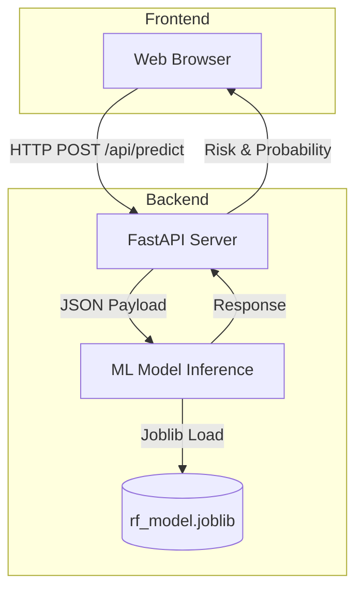

# Customer Churn Prediction Web App


A full-stack machine learning application designed to predict customer churn risk interactively. Built from a raw Jupyter Notebook, this project has been refactored into a production-ready system utilizing a Random Forest classifier with SMOTE for class imbalance, served by a FastAPI backend, and visualized through a modern React/Vite dashboard.

## Overview

The original model (Logistic Regression) suffered from severe class imbalance, predicting "Not Churn" for every instance. This refactored application upgrades the pipeline by implementing `imbalanced-learn`'s SMOTE technique and training a more robust `RandomForestClassifier`. The logic is exposed via a REST API and integrated into an interactive web interface suitable for portfolio demonstration and business use cases.

### Architecture



## Features

- **Interactive Predictor**: Tweak customer demographics, financial activity, and customer service interactions in real-time.
- **Dynamic Visualization**: Features a responsive gauge chart displaying the exact probability of churn and categorical risk levels (Low, Medium, High).
- **Modern UI/UX**: Dark mode by default, utilizing TailwindCSS for clean layouts, accessible contrast, and smooth transitions.
- **Production-Grade ML**: Cleanly refactored Python modules handling data loading, feature engineering, and inference.

## Prerequisites

Before running the application, ensure you have the following installed:
- [Docker](https://docs.docker.com/get-docker/)
- [Docker Compose](https://docs.docker.com/compose/install/)

*(Note: The required dataset `Customer_Churn_Data_Large.xlsx` must be placed in the root directory before running the initial backend training script if you plan to retrain the model locally. However, the Docker build handles standard operations).*

## Quick Start (Docker)

The fastest way to get the application running is via Docker Compose.

1. **Clone the repository:**
   ```bash
   git clone <your-repo-url>
   cd Customer-churn
   ```

2. **Run Docker Compose:**
   ```bash
   docker-compose up --build
   ```

3. **Access the Application:**
   - Frontend: `http://localhost` (or `http://localhost:80`)
   - Backend API Docs: `http://localhost:8000/docs`

## Local Setup (Without Docker)

### Backend Setup
```bash
cd backend
python -m venv venv
source venv/bin/activate  # On Windows: venv\Scripts\activate
pip install -r requirements.txt

# Run the training script (requires the Excel dataset in the project root)
python app/ml/train.py

# Start the server
uvicorn app.main:app --reload
```

### Frontend Setup
```bash
cd frontend
npm install
npm run dev
```

## Security & Performance Considerations

- **CORS Handling**: The backend explicitly configures CORS middleware. In a production environment, restrict origins to specific domains.
- **Environment Variables**: Use `.env` files for production to hide secrets and API URLs.
- **Validation**: Strict input validation is handled by Pydantic models on the backend.
- **Artifact Caching**: The ML model (`.joblib`) is loaded into memory once during backend startup (Singleton pattern) to ensure minimal inference latency.

---
Created by [Hakim](https://github.com/amhakimouse) 
